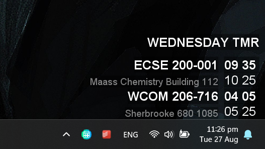
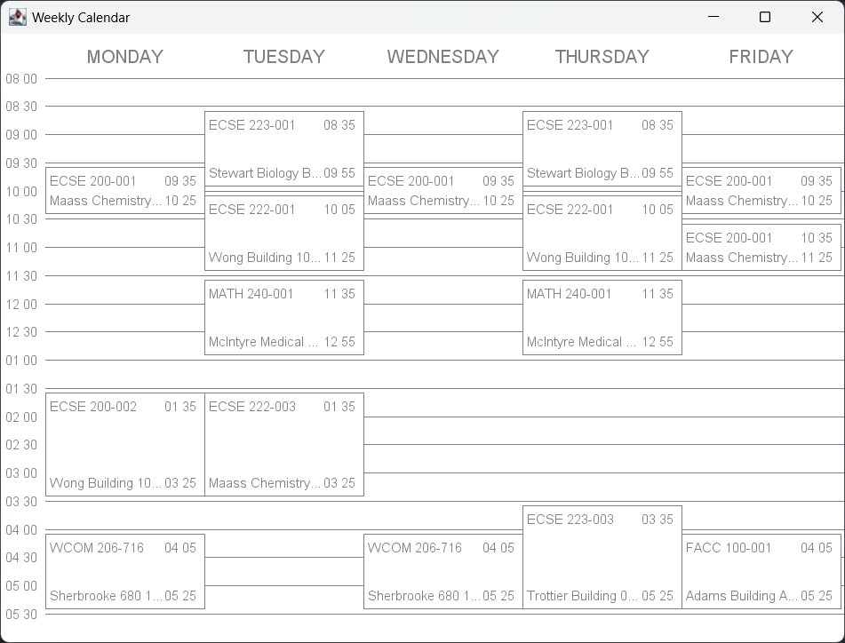

# Timetable Widget

# How to use

1. Upon launch no window may be displayed, you should see a tray icon appearing.
2. You might also be asked for minerva credentials, you can cancel if you want to key them in later.
3. Right-click on the tray icon to access settings.
4. Left-click on tray icon to toggle the daily schedule.
5. Double-click on the daily schedule to open a week view.

## Timetable

- Crawls timetable from `Minerva > Student Menu > Registration Menu > View Weekly Class Schedule`
- Displays the timetable for today on your bottom right.

## Auto Login

- If you do not use auto login, your credentials are not stored, but you have to key them in everytime you try to
  refresh.
- If you do use auto login, they are only stored in your computer under whatever place java preferences are.

## Make it run on startup

1. Download the latest release from here
2. Put it somewhere safe
3. Press `Win + R` to open up run
4. Type `shell:startup` and press enter to bring up startup folder
5. Create a shortcut to the jar file and move it here
